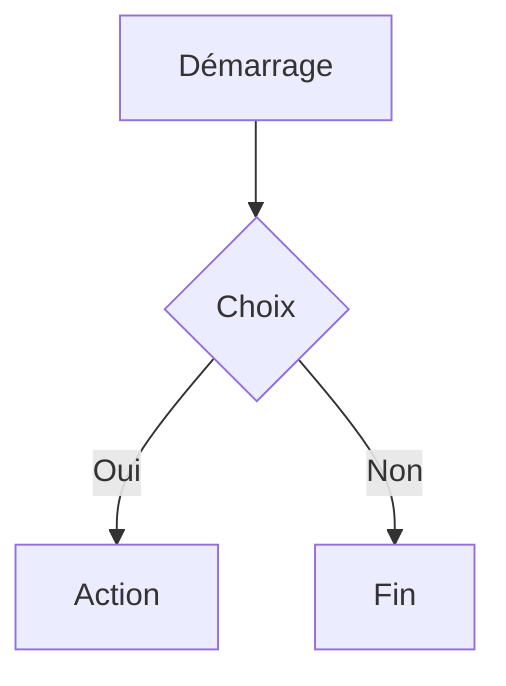
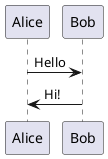

# Exemple Markdown

Ce document illustre la conversion vers LaTeX.

## Diagramme Mermaid

```mermaid
graph TD
    A[Démarrage] --> B{Choix}
    B -->|Oui| C[Action]
    B -->|Non| D[Fin]
```

```plantuml
@startuml firstDiagram

Alice -> Bob: Hello
Bob -> Alice: Hi!
		
@enduml
```

## Image

## Liste

- Élément 1
- Élément 2
