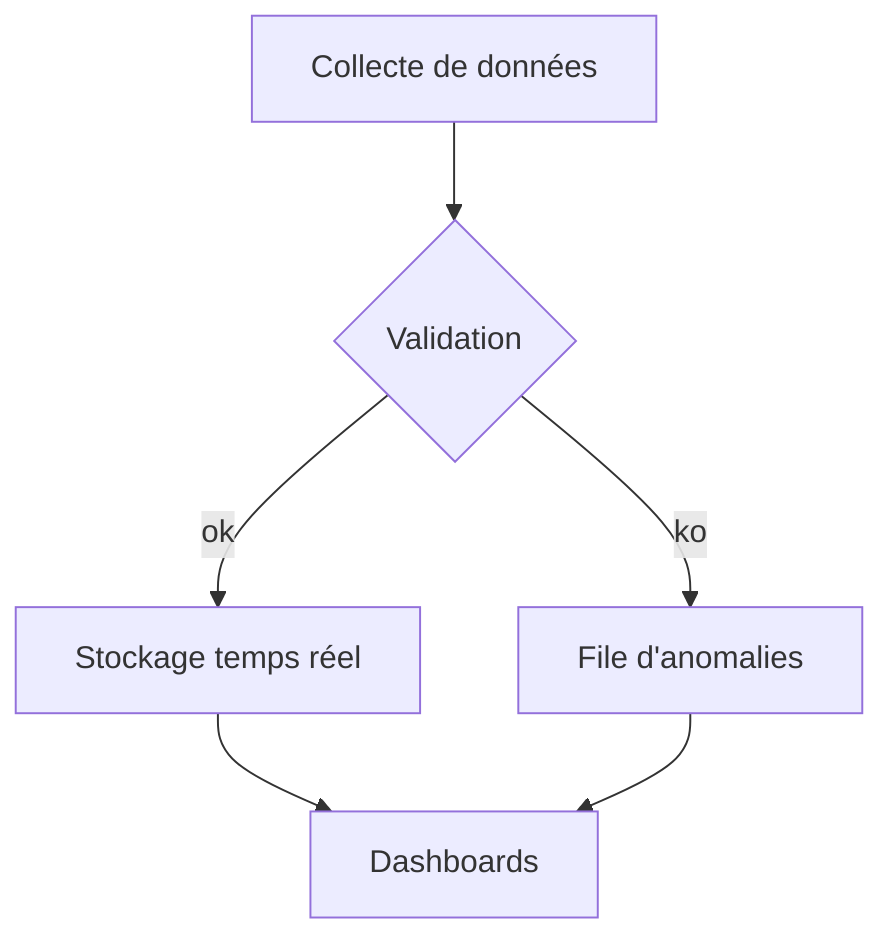
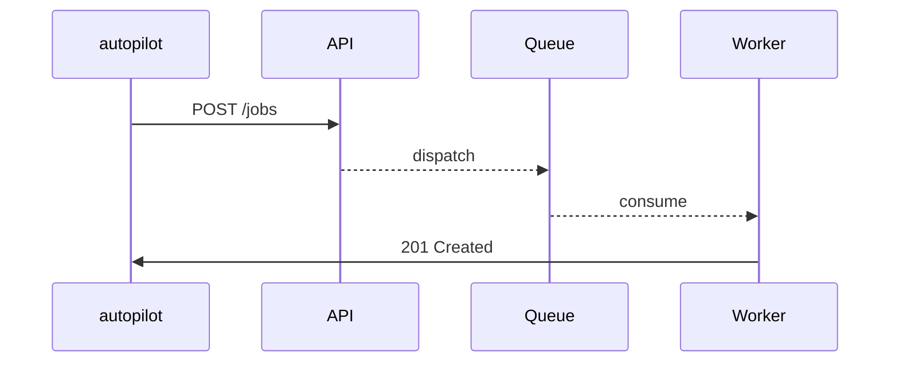

# Diagrammes Mermaid

Ce document illustre comment l'outil convertit des blocs ```mermaid``` en images centrées dans le PDF. Comme le rendu s'appuie sur `@mermaid-js/mermaid-cli`, assurez-vous que le binaire `mmdc` est présent dans le `PATH`.

## Diagramme de flux



## Diagramme de séquence



## Astuces

- Les thèmes Mermaid (`--mermaid-theme`) et le fond (`--mermaid-background`) peuvent être ajustés via la CLI.
- Utilisez des identifiants simples (ASCII) pour éviter les surprises lors de la génération.
- Le format par défaut est PNG avec une mise à l'échelle ×2 pour un rendu net dans LaTeX.
