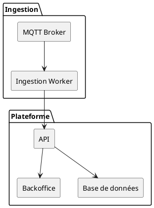
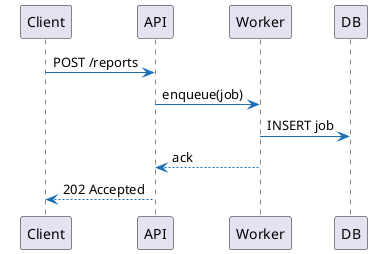

# Diagrammes PlantUML

Les blocs ```plantuml``` sont rendus via le CLI `plantuml` en sortie PDF vectorielle. Les fichiers générés restent nets quel que soit le niveau de zoom.

## Diagramme de composants



## Diagramme de séquence



## Conseils

- Changez le format avec `--plantuml-format svg` si vous préférez du SVG.
- Les diagrammes sont generés depuis l'entrée standard (`-pipe`), les includes externes ne sont donc pas nécessaires.
- Un encodage UTF-8 est appliqué par défaut (`--plantuml-charset`).
